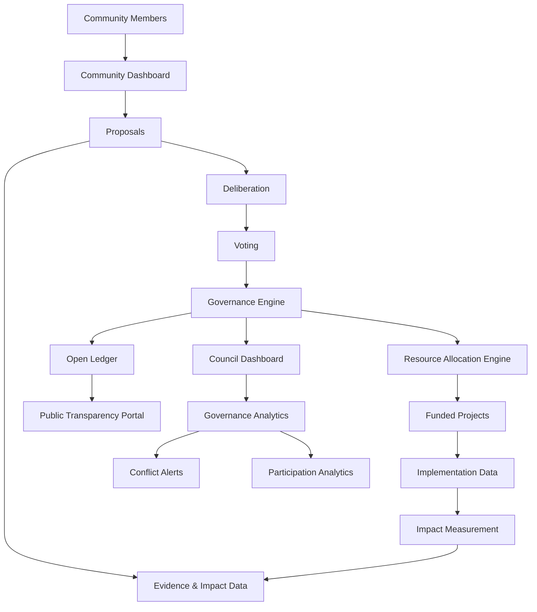
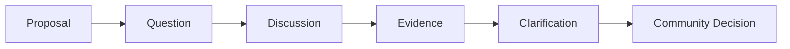
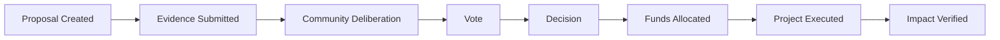
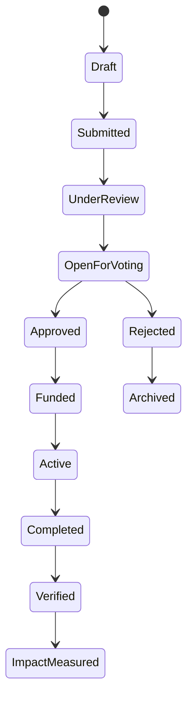

# Community Governance Dashboards

A transparent, participatory governance interface for **Atlas Sanctum** that enables communities to propose, deliberate, vote, allocate resources, and observe how collective decisions translate into measurable real-world outcomes.

The Community Governance Dashboards form the **civic coordination layer** of Atlas Sanctum.

They connect:

**People → Proposals → Deliberation → Voting → Resource Allocation → Measurement → Public Accountability**

---

## 1. Product Vision

Community Governance Dashboards transform governance from a periodic administrative process into a **continuous, evidence-linked coordination system**.

The system is designed to make collective decisions:

* **Visible** — people can see what is being proposed and decided.
* **Participatory** — eligible community members can contribute to decisions.
* **Evidence-based** — proposals connect to measurable impact data.
* **Traceable** — allocations and decisions produce an auditable record.
* **Accountable** — the public can observe how resources move.
* **Regenerative** — governance is connected to social, ecological, and economic outcomes.

### Core Principle

> **A governance decision should never disappear into a meeting room.**

Every significant decision should be traceable from:

`Proposal → Evidence → Vote → Allocation → Implementation → Outcome`

---

# 2. System Architecture



The architecture creates a closed feedback loop:

```text
COMMUNITY
    ↓
PROPOSAL
    ↓
DELIBERATION
    ↓
VOTE
    ↓
DECISION
    ↓
RESOURCE ALLOCATION
    ↓
IMPLEMENTATION
    ↓
MEASUREMENT
    ↓
PUBLIC ACCOUNTABILITY
    ↓
NEW EVIDENCE
    └──────────────────────→ COMMUNITY
```

---

# 3. Dashboard Ecosystem

The governance system consists of three primary interfaces:

| Interface               | Primary Users                                  | Purpose                              |
| ----------------------- | ---------------------------------------------- | ------------------------------------ |
| **Community Dashboard** | Residents, members, stakeholders               | Participate in governance            |
| **Council Dashboard**   | Councils, administrators, governance teams     | Analyze and administer governance    |
| **Transparency Portal** | Public, researchers, journalists, institutions | Observe decisions and resource flows |

---

# 4. A. Community Dashboard

## Mobile + Web Hybrid

The Community Dashboard is the primary citizen-facing interface.

It should be optimized for:

* Mobile devices
* Low-bandwidth environments
* Simple navigation
* Accessible language
* Progressive disclosure of complex information
* Voice and text participation

---

## Screen: Home

### Active Proposals

The home screen surfaces proposals requiring community attention.

### Proposal Card

Each card contains:

```text
┌───────────────────────────────────────┐
│ WATERSHED RESTORATION PROJECT        │
│                                       │
│ Restore 25 hectares of degraded       │
│ watershed land.                       │
│                                       │
│ Voting Progress                       │
│ ███████████████░░░░░░ 68%             │
│                                       │
│ 4 days 12 hours remaining             │
│                                       │
│              [ VOTE NOW ]             │
└───────────────────────────────────────┘
```

### Card Data

Each proposal card should expose:

* Proposal title
* Short description
* Voting progress
* Participation count
* Time remaining
* Proposal category
* Geographic scope
* Estimated budget
* Current status

### CTA

`Vote Now`

---

# 5. Screen: Proposal Detail

The Proposal Detail screen provides the complete decision context.

## Information Architecture

### Proposal Header

```text
Proposal Title
Status
Region
Submitted By
Submission Date
Voting Deadline
```

### Description

A complete explanation of:

* Problem
* Proposed intervention
* Objectives
* Beneficiaries
* Budget
* Implementation plan
* Risks
* Responsible organization

---

## Impact Summary

Each proposal should connect governance decisions to evidence.

Example:

```text
EXPECTED IMPACT

Water Security
██████████████░░ 82%

Households Benefited
12,500

Estimated Restoration
25 hectares

Projected Annual Water Retention
+18%
```

Impact metrics should link to the Atlas Sanctum measurement layer.

```text
Proposal
   ↓
Evidence
   ↓
Baseline
   ↓
Target
   ↓
Intervention
   ↓
Measured Outcome
```

This prevents governance from becoming disconnected from implementation.

---

# 6. Voting Interface

Eligible participants can submit a decision.

### Voting Actions

```text
✅ APPROVE

❌ REJECT
```

The interface should make the consequences of each decision understandable before submission.

### Vote Metadata

A vote may contain:

* Decision
* Timestamp
* Governance jurisdiction
* Eligibility verification
* Optional comment
* Optional rationale
* Verification status

Sensitive identity information should not be exposed through the public interface unless explicitly authorized by the governance framework.

---

# 7. Deliberation & Comments

Community members can discuss proposals before and after voting.

### Supported Inputs

* Text comments
* Voice comments
* Replies
* Reactions
* Evidence attachments
* Questions
* Clarifications

### Discussion Model



Voice participation is particularly important for communities where typing-heavy interfaces create unnecessary barriers.

---

# 8. Screen: Resource Allocation

The Resource Allocation interface shows how approved decisions translate into funding.

## Visualization

### Fund Allocation

Example:

```text
TOTAL FUND
$250,000

        ┌─────────────────────┐
        │                     │
        │    FUNDING MIX      │
        │                     │
        │   Restoration       │
        │   Infrastructure    │
        │   Water             │
        │   Monitoring        │
        │                     │
        └─────────────────────┘
```

A pie chart or equivalent visualization displays allocation by:

* Project
* Category
* Region
* Program
* Funding source

---

## Projects Funded

Each project displays:

| Project                    |  Amount | Status    |
| -------------------------- | ------: | --------- |
| Watershed Restoration      | $50,000 | Active    |
| Water Kiosk Network        | $35,000 | Active    |
| Community Monitoring       | $15,000 | Planned   |
| Ecological Data Collection | $10,000 | Completed |

### Project Status

Recommended state model:

```text
PROPOSED
   ↓
APPROVED
   ↓
FUNDED
   ↓
ACTIVE
   ↓
COMPLETED
   ↓
VERIFIED
   ↓
IMPACT MEASURED
```

---

# 9. B. Council Dashboard

## Advanced Governance Interface

The Council Dashboard is designed for authorized governance bodies, administrators, oversight teams, and institutional partners.

It provides deeper analytical capabilities than the Community Dashboard.

---

# 10. Screen: Governance Analytics

The Governance Analytics screen provides a real-time overview of participation and decision-making.

### Core Metrics

```text
PARTICIPATION RATE
74.6%

ACTIVE PROPOSALS
18

COMPLETED VOTES
126

COMMUNITY MEMBERS PARTICIPATING
8,420

ALLOCATED RESOURCES
$2.4M
```

---

## Participation Analytics

Analyze participation across:

* Region
* Community
* Time
* Proposal category
* Governance cycle
* Demographic aggregates where lawful and appropriate

Example:

```text
Participation Over Time

100% ┤
 80% ┤             ╭─────╮
 60% ┤       ╭─────╯     ╰──╮
 40% ┤  ╭────╯              ╰──
 20% ┤──╯
  0% └──────────────────────────
       Jan  Feb  Mar  Apr  May
```

The objective is not simply to maximize participation, but to understand whether governance processes are accessible and representative of the eligible community.

---

# 11. Voting Distribution Heatmap

A heatmap allows governance teams to observe voting patterns geographically and temporally.

```text
           REGION A   REGION B   REGION C

Proposal 1    ███        ██         ████
Proposal 2    ██         ████       █
Proposal 3    ████       ███        ██
Proposal 4    █          ███        ████
```

Possible dimensions:

* Region
* Ward
* Community
* Proposal category
* Voting period
* Approval/rejection distribution

The dashboard should distinguish **descriptive voting patterns** from interpretations about why those patterns occurred.

---

# 12. Conflict Alerts

The Governance Analytics system can flag proposals or transactions requiring human review.

### Example Alerts

```text
⚠ Conflict Alert

Proposal:
Watershed Restoration — Zone 04

Reason:
Potential overlap detected between
project beneficiary and submitting entity.

Status:
REQUIRES REVIEW
```

Potential signals may include:

* Declared conflicts of interest
* Duplicate proposals
* Duplicate funding requests
* Unusual allocation patterns
* Missing documentation
* Budget anomalies
* Governance-rule violations
* Contradictory records

### Important Principle

Conflict detection should function as a **decision-support mechanism**, not an automated accusation system.

Every alert should preserve:

```text
Signal
  ↓
Evidence
  ↓
Human Review
  ↓
Resolution
  ↓
Audit Record
```

---

# 13. C. Transparency Portal

## Public Governance Interface

The Transparency Portal provides an open view of governance activity.

Its purpose is to answer a fundamental public question:

> **What was decided, where did the resources go, and what happened afterward?**

---

# 14. Screen: Open Ledger

The Open Ledger presents governance activity as a chronological public feed.

### Example

```text
OPEN LEDGER

25 SEP 2026

$50,000
Allocated to watershed restoration

Project:
Nairobi Watershed Restoration

Status:
ACTIVE

────────────────────────────

$35,000
Allocated to community water infrastructure

Project:
Water Kiosk Network

Status:
FUNDED
```

---

# 15. Ledger Filters

Users can filter records by:

```text
REGION
PROJECT
DATE
```

Additional filters can include:

* Funding source
* Governance body
* Project category
* Proposal
* Status
* Implementing organization

---

# 16. Governance Audit Trail

Each material governance event should produce an immutable or tamper-evident audit record.



The public ledger should expose the appropriate evidence for each stage.

---

# 17. Core Data Model

A simplified governance data model:

```text
User
 ├── identity
 ├── governance roles
 └── eligibility

Proposal
 ├── title
 ├── description
 ├── submitter
 ├── region
 ├── budget
 ├── evidence
 ├── impact targets
 └── status

Vote
 ├── proposal
 ├── participant
 ├── decision
 ├── timestamp
 └── rationale

Allocation
 ├── proposal
 ├── project
 ├── amount
 ├── funding source
 └── status

Project
 ├── objectives
 ├── implementing entity
 ├── milestones
 ├── budget
 └── impact metrics

ImpactMeasurement
 ├── metric
 ├── baseline
 ├── target
 ├── observed value
 ├── timestamp
 └── verification source

LedgerEvent
 ├── event type
 ├── entity
 ├── amount
 ├── timestamp
 └── audit reference
```

---

# 18. Governance Lifecycle

The complete lifecycle can be represented as:



---

# 19. Design Principles

## 19.1 Evidence Before Decision

Proposals should present relevant evidence before users vote.

## 19.2 Participation Without Complexity

The community interface should make participation understandable without requiring users to understand the underlying technical infrastructure.

## 19.3 Transparency by Default

Material decisions and resource movements should become visible through the public transparency layer, subject to legitimate privacy and security constraints.

## 19.4 Accountability Through Measurement

Funding should not be the final event.

The governance loop ends with:

**Verified Impact.**

## 19.5 Human Governance

AI can help identify patterns, summarize evidence, detect anomalies, and surface conflicts.

It should not silently replace legitimate human governance.

---

# 20. Atlas Sanctum Integration

The Governance Dashboards integrate with the broader Atlas Sanctum architecture.

```text
                   ATLAS SANCTUM
                         │
        ┌────────────────┼─────────────────┐
        │                │                 │
   OBSERVATORY        GOVERNANCE       MARKETPLACE
        │                │                 │
        │          ┌─────┴─────┐           │
        │          │           │           │
     DATA →     COMMUNITY    COUNCIL     CAPITAL
        │          │           │           │
        └──────────┼───────────┼───────────┘
                   │
              TRANSPARENCY
                   │
               OPEN LEDGER
                   │
             IMPACT MEASUREMENT
```

The Governance Dashboard therefore becomes the mechanism through which **intelligence becomes collective action**.

---

# 21. Suggested Technical Stack

### Frontend

* React
* TypeScript
* Vite
* Tailwind CSS
* Responsive Web
* React Native / Expo for mobile

### Backend

* Node.js / NestJS
* PostgreSQL / Supabase
* GraphQL or REST APIs
* Event-driven services

### Data & Analytics

* PostGIS
* GIS / geospatial layers
* Time-series impact data
* Analytics pipelines
* Observability infrastructure

### Governance

* Role-Based Access Control (RBAC)
* Attribute-Based Access Control (ABAC)
* Proposal engine
* Voting engine
* Allocation engine
* Audit logging

### Transparency

* Public API
* Open Ledger
* Tamper-evident audit records
* Exportable datasets

---

# 22. Security & Integrity

Governance systems require substantially stronger controls than ordinary social applications.

The implementation should consider:

* Authentication
* Authorization
* Vote integrity
* Audit logging
* Anti-double-voting controls
* Sybil-resistance mechanisms
* Data encryption
* Rate limiting
* Fraud detection
* Conflict-of-interest controls
* Secure financial integrations
* Privacy-preserving identity
* Disaster recovery

Sensitive governance and identity data should be separated from information intended for public transparency.

---

# 23. MVP Scope

The first implementation can remain deliberately narrow.

### Community MVP

```text
Home
 ↓
Active Proposals
 ↓
Proposal Detail
 ↓
Evidence / Impact Summary
 ↓
Vote
 ↓
Comment
```

### Council MVP

```text
Governance Analytics
 ↓
Participation
 ↓
Voting Distribution
 ↓
Conflict Alerts
 ↓
Allocation Monitoring
```

### Public MVP

```text
Open Ledger
 ↓
Search
 ↓
Filter
 ↓
Transaction / Allocation Detail
```

---

# 24. Future Evolution

The governance layer can progressively expand into:

* Participatory budgeting
* Community grants
* Cooperative governance
* County-level governance interfaces
* Environmental governance
* Water governance
* Infrastructure prioritization
* Community land-use decisions
* Disaster-response coordination
* Regenerative finance governance
* DAO-compatible governance mechanisms
* AI-assisted policy simulation
* Digital public infrastructure integrations

---

# 25. North Star

The ultimate purpose of the system is not to create another dashboard.

It is to create a **living civic feedback loop** in which communities can:

```text
SEE
 ↓
UNDERSTAND
 ↓
DELIBERATE
 ↓
DECIDE
 ↓
ALLOCATE
 ↓
ACT
 ↓
MEASURE
 ↓
LEARN
 ↓
IMPROVE
```

### Atlas Sanctum Governance Principle

> **Make collective decisions visible, make resource flows traceable, and make outcomes measurable.**

The Community Governance Dashboards are the interface between **community agency and measurable regeneration**.
